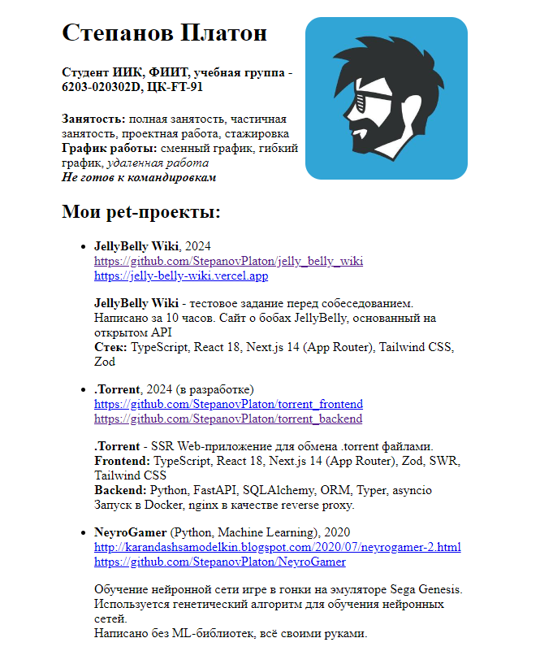

# Лабораторная работа №2

**Цель работы:** научиться создавать CSS стили и подключать CSS стили к HTML элементам. При работе со стилями рекомендуется задавать стили с помощью классов (.class)

**Описание работы:** страница-резюме, с использованием базовых HTML тэгов и добавлением стилей с помощью .сss файла

