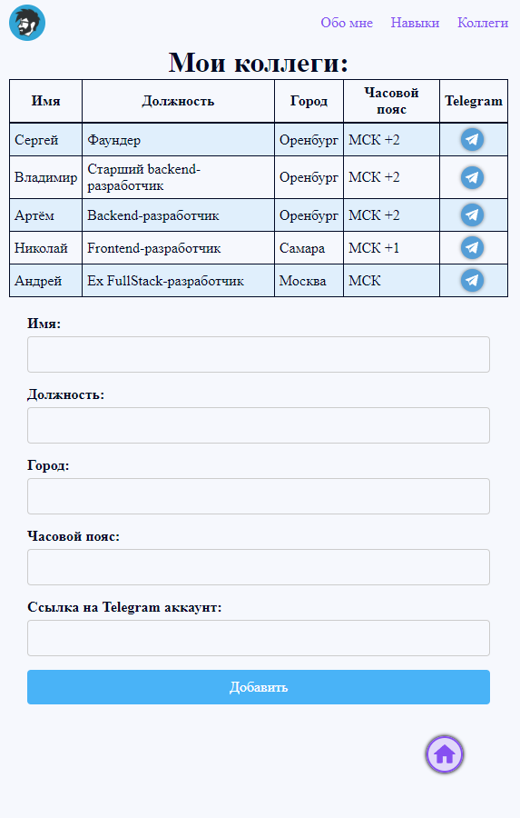

# Лабораторная работа №5

**Цель работы:** научиться обрабатывать действия пользователя на странице с помощью
HTML форм

**Описание работы:** добавлена форма, добавления данных в таблицу на странице коллег

|||
|-|-|
||